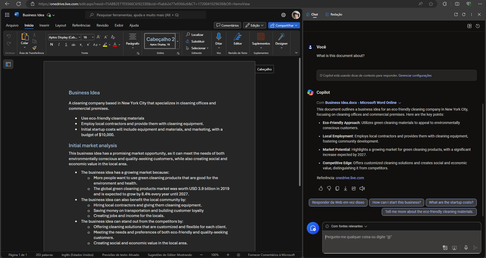
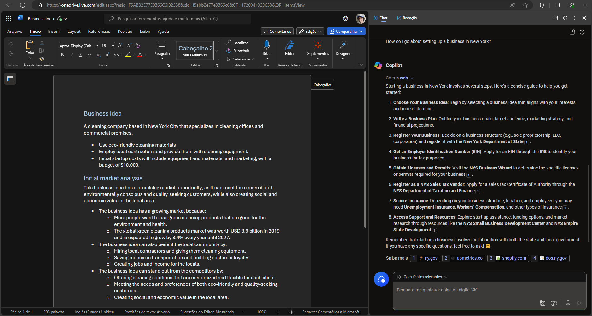
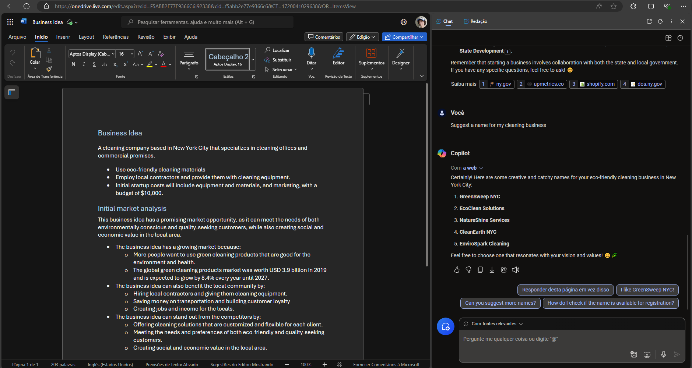
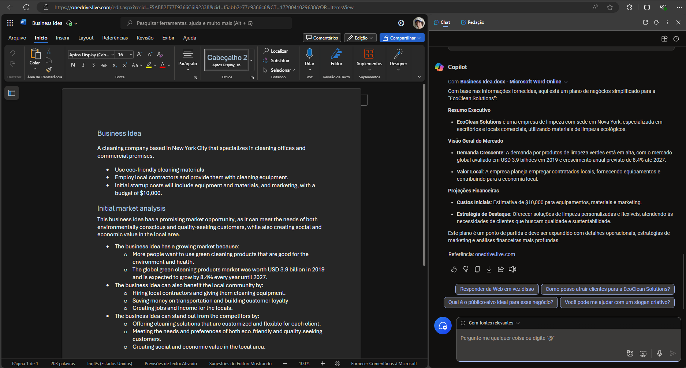

# Laboratorio5Dio

## Preparando o laboratório
- Começamos abrindo o oneDrive no navegador Microsoft Edge
- Em seguida peguemos o arquivo do roteiro do laboratório e fazemos o upload deste arquivo na pasta "Documents"
- Então nós abrimos o Microsoft Copilot do navegador

## Usando o Copilot para compreender melhor o texto
- Inserimos o seguinte comando: What is this document about?

- Em seguida inserimos mais um comando:  How do I go about setting up a business in New York?

## Usando o Copilot para criar conteúdo para um plano de negócios
- Utilizemos o seguinte comando:  Suggest a name for my cleaning business

- Depois utilzemos esse comando: Write a business plan for "EcoClean Solutions" based on the information in this document. Include an executive summary, market overview, and financial projections.
- 
