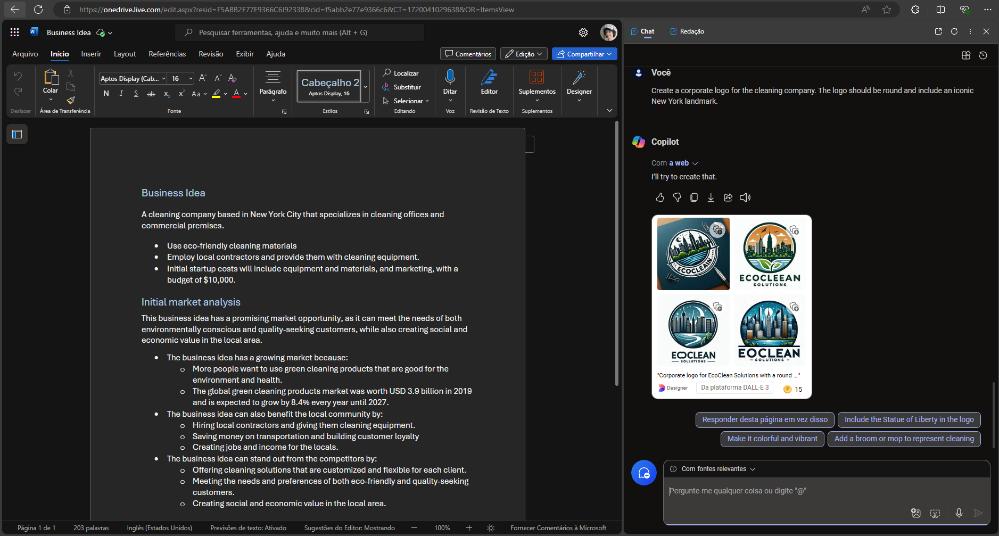
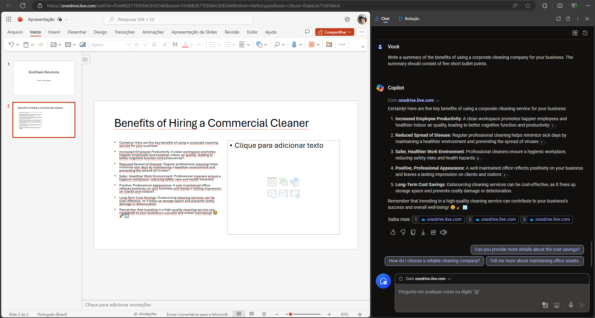
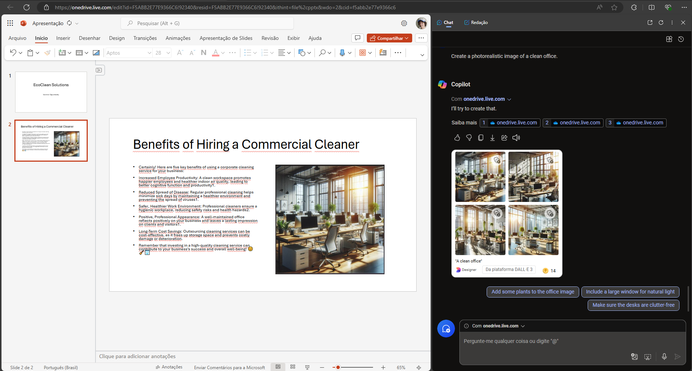
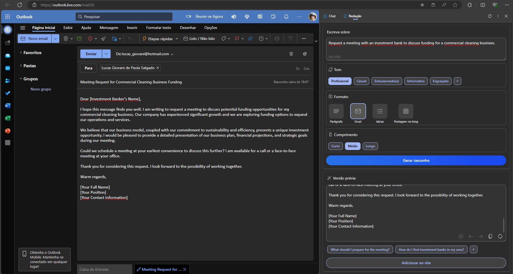

# Laboratorio5Dio

## Preparando o laboratório
- Começamos abrindo o oneDrive no navegador Microsoft Edge
- Em seguida peguemos o arquivo do roteiro do laboratório e fazemos o upload deste arquivo na pasta "Documents"
- Então nós abrimos o Microsoft Copilot do navegador

## Usando o Copilot para compreender melhor o texto
- Inserimos o seguinte comando: What is this document about?

- Em seguida inserimos mais um comando:  How do I go about setting up a business in New York?


## Usando o Copilot para criar conteúdo para um plano de negócios
- Utilizemos o seguinte comando:  Suggest a name for my cleaning business

- Depois utilzemos esse comando: Write a business plan for "EcoClean Solutions" based on the information in this document. Include an executive summary, market overview, and financial projections.

- Emseguida vamos criar uma logo com o seguinte comando:  Create a corporate logo for the cleaning company. The logo should be round and include an iconic New York landmark.

- Para não deixar o arquivo poluido, peço para que confira a pasta de "inputs" para poder conferir as logos criadas em maior resolução.

## Usando o Copilot para criar uma apresentação
- No Onedrive criaremos uma nova apresentação em powerpoint na mesma pasta que se encontra o nosso arquivo word
- Coloque o nome da empresa escolhida no título e coloque o seguinte texto no subtitulo: "Investor Opportunity"
- Crie um novo slide com o layout para dois conteúdos e coloque o seguinte título: Benefits of Hiring a Commercial Cleaner
- Agora no Copilot coloque o seguinte comando: Write a summary of the benefits of using a corporate cleaning company for your business. The summary should consist of five short bullet points.

- Em seguida entre com este comando:  Create a photorealistic image of a clean office.

- Mude o titulo do arquivo para: Business Presentation.pptx

## Usar o Copilot para compor um email
- Abra o Outlook
- Crie um novo email e coloque seu proprio email como destinatário
- Siga o seguinte comando no painel "Redação" do Copilot
```
Write about: Request a meeting with an investment bank to discuss funding for a commercial cleaning business.
Tone: Professional
Format: Email
Length: Medium
```

